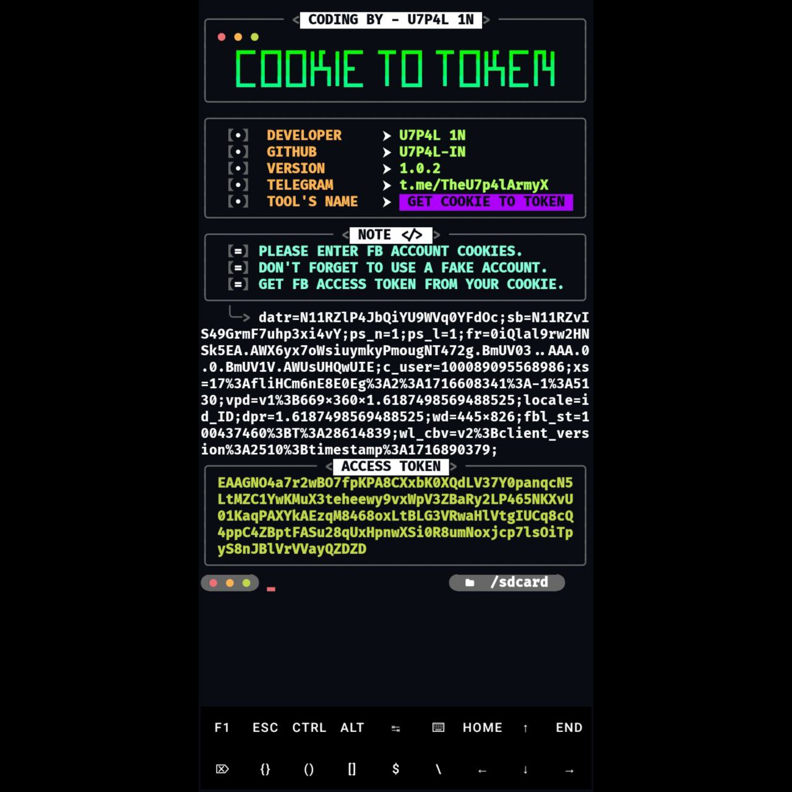

<p align="center">
</p>

</p>
   <p align="center">
      <a href="https://github.com/U7P4L-IN/TOKEN/stargazers">
      </a>
      <a href="https://github.com/U7P4L-IN/TOKEN/releases/latest">
      </a>
      <a href="https://www.conventionalcommits.org/en/v1.0.0/">
      </a>
      <a href="https://github.com/U7P4L-IN/TOKEN/actions/workflows/github-action.yml">
      </a>
   </p>
   
</br>

>A Facebook cookie to access token converter is a tool or script that facilitates the transformation of a Facebook cookie into an access token

[1] - Facebook Cookie:

* A cookie is a small piece of data stored on your device by a website you visit. In the context of Facebook, cookies are used to maintain session information, track user preferences, and enable features like staying logged in.
* When you log in to Facebook, a cookie is generated and stored in your browser. This cookie contains information related to your session, authentication, and other settings.

[2] - Access Token:

* An access token is a secure and temporary credential that allows an application (or a user) to access specific resources on behalf of the user.
* In the case of Facebook, an access token grants permission to perform actions like posting, reading user data, or interacting with the Facebook Graph API.

<h4 align="left">TESTED ON > </h4>

* Kali Linux
* Termux
* Mac os
* Ubuntu
* Perrot Sec OS

<h4 align="left">INSTALL TOOL ON TERMUX > </h4>
 
```python
apt update && apt upgrade -y
pkg install git
pkg install python
rm -rf TOKEN
git clone --depth=1 https://github.com/U7P4L-IN/TOKEN.git
cd TOKEN
python main.py
```
<p align="center">

<h5 align="center"><b>TERMUX</b></h5>

<p align="center">
<p align="center";> 


# Report bugs
If you notice issues while installing this tool or running this tool kindly mail to me at <a href="mailto: AnonyminHack5@protonmail.com">Gmail</a> or Open an issue via github.

### Requirements 
```
python-3
pip
Internet Connection
And some other python packages
``` 
[Python 3](https://www.python.org/downloads/)

<hr>

<h2 align="left">Install Requirements (on Linux) > </h2><br>

```python
>> apt-get install git python3 python3-pip python python-pip
```
<h2 align="left">Kali Linux/Ubuntu/Parrot os > </h2><br>

```python
sudo apt-get update && apt-get install git
git clone https://github.com/U7P4L-IN/TOKEN.git
cd TOKEN
ls
sudo python3 main.py
```
<h5 align="center"><b>KALI LINUX</b></h5>

<p align="center">
<p align="center">
  
</br>

<p align="center">  <a href="https://t.me/TheU7p4lArmyX"></a></p>

</br>

### Tools Languages :

<p align="center">

</p>

<br>

### No tokens appearing?

- Doesn't work for cookies or new accounts!
- Maybe your Facebook account is checkpointed or locked.
- The Facebook system has been repaired causing failure to get tokens.

### Why login failed?

- Your Facebook account cookies are no longer valid or expired.
- Your Facebook account is logged out of the browser.
- Maybe your Facebook account has been checkpointed or temporarily locked.

### Contributing
Feel Free To Clone This Project. For Major Changes, Please Open An Issue First To Discuss What You Would Like To Change Or Add, Thank You!!.

<h2 align="center">LICENSE</h2>

**Cookie to Token** converter is released under the MIT license, which grants the following permissions:
- Commercial use
- Modification
- Distribution
- Patent use
- Private use

For more convoluted language, see the [LICENSE](/LICENSE).
</br>

<h5 align="center"><b>DESCRIPTION</b></h5>

* ©️ Copyright Message
>> Copyright © [2023-27] [U7P4L-IN]
>All rights reserved. This Python project, along with its code, documentation, and any associated files, is the intellectual property of ANONYMOUS CYBER. You may not reproduce, distribute, or modify the contents of this repository without explicit permission from the owner.
# Give A Star ⭐

> You can also give this repository a star to show more people and they can use this repository.
